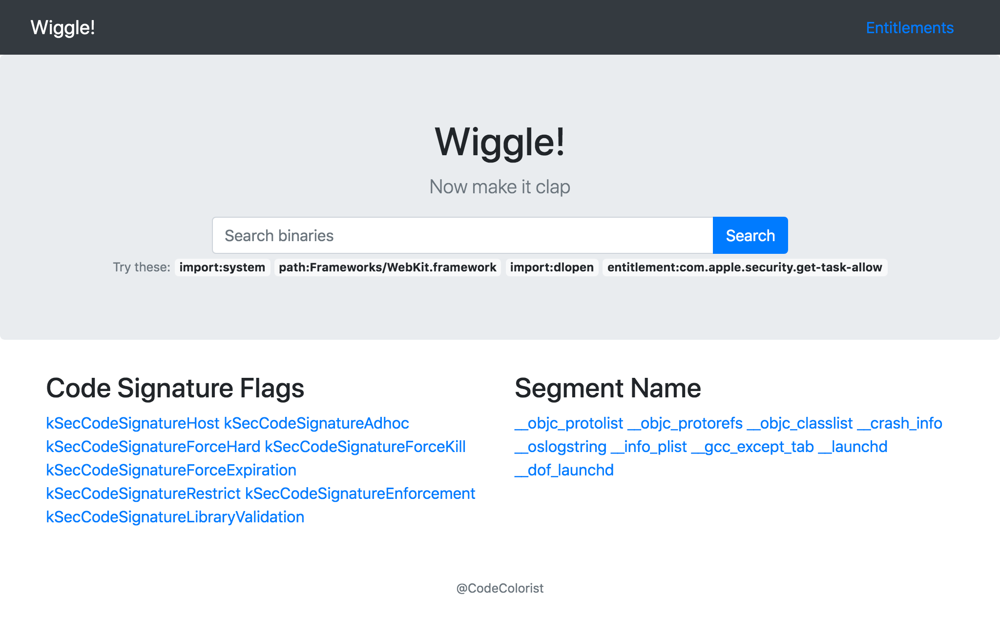

# Wiggle



An executable binary metadata search engine. Currently MachO only.

## Prerequisite

* docker and docker-compose
* Python3 (no support for Python2)
* radare2 (on collector)

## Usage

1. Run the collector

    Install dependencies first:
    ```sh
    pipenv install
    ```

    Note: docker is not required to run the collector.

    ```sh
    python3 scan.py /System/Library/Frameworks /System/Library/PrivateFrameworks /usr/lib /usr/bin /usr/sbin /sbin /usr/libexec
    ```

    Or specifying a file that includes the directories you want to scan

    ```sh
    python3 scan.py --rule presets/app.txt
    ```

    For mounted filesystem, you can set the filesystem root by specifying `--sysroot`.

    To skip some the directories, use `--block block_list.txt` (wildcard not supported yet)

1. Start the server

    ```sh
    docker-compose up -d
    ```

1. Migrate the data to the full text search

    ```sh
    # todo: docker mount read only
    docker-compose run web python /agent/indexer.py 10.14.2 /agent/archive.db
    ```

1. Open localhost:8000 in the browser

## FAQ

### Why doesn't the collector directly save the document, but using a SQLite database pipeline instead?

So the collector and the server don't have to be the same machine.

## TODO

- Backend
    - **Support other formats: ELF, PE etc**
    - Support dyld_shared_cache
    - Consider moving to postgres
- UI
    - Autocomplete
    - AJAX

## Known Issue

### Stability

The collector is extermely unstable now, the scanning process can be interrupted any time

### Nested documents limitation

> The number of nested documents has exceeded the allowed limit of [10000]. This limit can be set by changing the [index.mapping.nested_objects.limit] index level setting.

Need to improve the database design the overcome this instead of just changing the value

### Numeric value -1

> Numeric value (12727174745972277247) out of range of long (-9223372036854775808 - 9223372036854775807)

Some of the values from radare2 are `0xffffffffffffffff` that cause the exception

### Performance

Single node ElasticSearch sucks. Really. Should consider migrating to postgreSQL.

## Acknowledgement

Wiggle is based on these awesome open source projects:

* [radare2](https://rada.re/r/)
* [LIEF](https://lief.quarkslab.com/)
